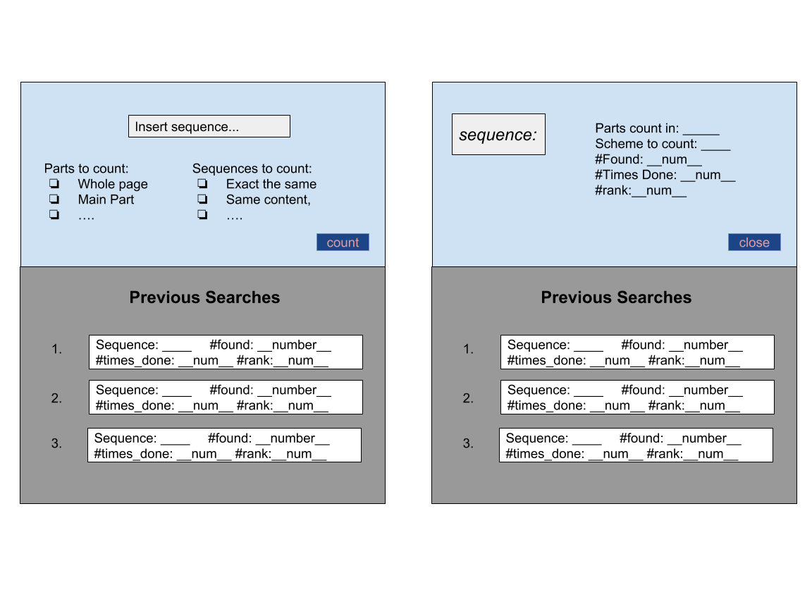

# Gamitee Front-end Challenge

Hello!

To better appreciate your front-end software development skills, we would like you to write a website widget that scans the webpage and counts how many times a certain sequence of letters appears in it.

## General guidelines

- before you start, please read all the instructions carefully.
- Wherever the widget behavior is undefined it is at your discretion to decide.
- Your solution should be responsive.
- Wherever possible, front-end elements should conform with [google material design](https://material.io/design/).
- Challenge usually takes about five hours to complete, but take your time, there are no extra points for speed 😊.

Feel free to ask any question if necessary.

Good luck and enjoy!

The Gamitee team

# Building a string-counting widget

Write a hovering button on-top of the webpage that when clicked opens a modal with a dialog box to input a sequence of letters and an action button to execute.

1. This modal should enable several methods of searching and counting, detailed below.
2. After executing, the code will count the number of letter sequences that satisfy the conditions and will send it to a server-like module, detailed below. Immediately upon receiving approval from the server-module the number will be displayed to the user.
3. Also, a request should be sent to the server-module to receive the number of times that this specific search has been executed and what the results were. Immediately upon receiving this data from the server-module the number will be displayed to the user.
4. These two requests and their response should be Independent.
5. After receiving these two answers the user should be displayed the relative position of his search result number compared to other searches executed.
6. When clicking to close the modal, the current search will be sent to a list of previous searches and the modal will close.

## Challenge guidelines

- Write your solution in the sol.js file provided. This file imports the server and the Jquery library.
- The sol.css file should hold all the necessary CSS for the design of the components you’ve added.
- You’ve been provided with two html files: the Wikipedia and MDN pages on Javascript. These files already include the scripts for sol.js and sol.css.
- Please notice that you should complete the challenge so that the same sol.js file will work on both web-pages, and for that you are allowed to add different extra files to each page.
- The same CSS rules should apply to your modal on both pages.
- The button design could be done separately for each page.

## **A sketch of the desired modal:**

**Before and After execution**

## **Searching and counting options**

### Parts of the page to count in

1. Entire page
2. Only text currently displayed (exclude display:none)
3. Only text that’s in the primary section of the page (excluding headers, footers, navigation menus etc.)

### Sequence types to count

1. Exact string
2. Same length string that contains the same letters but not necessarily in the same order
3. String of a user-specified length that contains the same letters, not necessarily in the same order

## **Server-module specifications**

* A request is executed similarly to a regular XHR request, by calling `new FakeHttpRequest`

* After that, `open` can be called with one of two parameters: GET or POST, and `send` is always called with the current search result.

* `onload` defines the callback with the response from the server:

    * If it’s a GET request it is read with an array (with a random size between 6 and 1) with numbers (also random) that represent the similar search results.
    * If it’s a POST it is read with the value of the current search.